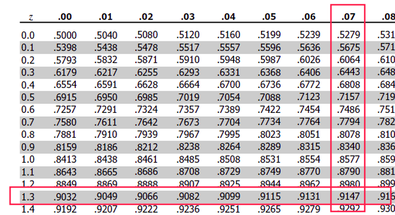

In probability theory and statistics, **the binomial distribution** with parameters $n$ and $p$ is the discrete probability distribution of the number of successes in a sequence of $n$ **independent** experiments, each asking a yes–no question, and each with its own boolean-valued outcome: success/yes/true/one (with probability $p$) or failure/no/false/zero (with probability $q = 1 − p$).

**Probability Mass Function**:

$$P(x=X) = {{n}\choose{k}} \cdot p^kq^{n-k}$$ 
where $k$ is the number of successes.

For exaple, what is the probability of 3 Heads in total of 6 coin tosses? Assume that the coin is fair ($p_\text{H} = p_\text{T} = \frac{1}{2}$).

$$P(x=3) = {{7}\choose{3}} \cdot \frac{1}{2}^3 \cdot (1 - \frac{1}{2})^{7-3} = \frac{7!}{3! \cdot 4!} \cdot \frac{1}{8} \cdot \frac{1}{16} = ... \approx 0.273$$ 

Calculating equations for such small numbers like in this example can be easily done by pen and paper. Imagine following example: study suggests that a new drug is 74% effective in dealing with a disease X. Suppose 100 patients who has such disease were randomly selected. What is the probabilty that drug will help 80 or more of them?

$$P(x \geq 80) = {{80}\choose{100}} \cdot 0.74^{80} \cdot (1 - 0.74)^{100-80} + {{81}\choose{100}} \cdot 0.74^{81} \cdot (1 - 0.74)^{100-81} $$ 
$$ + ... $$ 
$$+ {{99}\choose{100}} \cdot 0.74^{99} \cdot (1 - 0.74)^{100-99} + {{100}\choose{100}} \cdot 0.74^{100} \cdot (1 - 0.74)^{100-100}$$ 

It is not an easy task to do by hand, bun it can be done using software, for example:

```{r collapse = TRUE}
n <- 100
k <- 80
p <- 0.74
print(sum(dbinom(x = k:n, size = n, p = p)))
#or
print(1 - pbinom(q = k-1, size = n, prob = p))
```

However, binomial distribution can be approximated by normal distribution with parameters $\mu = np, \sigma = \sqrt{npq}$, where $np$ and \sqrt{npq} and $\sqrt{npq}$ are expected value and standard deviation of Binomial distribution respectively.

$$B(n,p) \sim N(\mu=np, \sigma = \sqrt{np(1-p)})$$
In order to be able to approximate Binomial distribution two conditions are needed to be met:

1. $np \geq 10$
2. $n(1-p) \geq 10$

Or in other words, expected number of success **and** failures need to be equal or greater than 10.

Checking conditions for our example:

1. $np = 100 \cdot 0.74 = 74 \geq 10$
2. $n(1-p) 100 \cdot 0.26 = 26 \geq 10$

Conditions are met so we can use Normal distribution. And now that we have Normal approximation the task of finding probability that drug will help 80 or more patients can be found as area under the line by taking the integral of normal distribution fucntion:

$$P(x \geq 80) = \int_{80}^{\infty} f(x)dx$$

Calculating the integral also doesn't seem like an easy task to do. TO simplify this, we we could find the $Z$ score (value of the standard normal distribution):

$$Z = \frac{X - \mu}{\sigma}$$

$$\mu = np = 100 \cdot 0.74 = 74$$
$$\sigma = \sqrt{np(1-p)} = \sqrt{100 \cdot 0.74 \cdot 0.26} = \sqrt{19.24} \approx 4.39$$
$$Z = \frac{80 - 74}{4.39} \approx 1.37$$

Now, using this value we can refer to any Z-table tables (like [this one](http://www.z-table.com/)) and find the **left** tail:

<center></img></center>

Since we need the probability that $x$ is greater than 1.32 we do the substraction:

$$P(x>1.37) = 1 - P(x<1.37) = 1 - 0.9147 = 0.0853$$
In other words, probability that new drug will be effective for 80 or more patients is 8.53%.

Note that this value differs from the value that was calculated using `pbinom` function (10.27%). This is cased by the fact that integral is not sensitive to sign of the equation ($>$ or $\geq$). It can be fixed using **0.5 correction**. You add or substract 0.5 value for $Z$ score calculations (depending on strict or not strict condition you have).

```{r collapse = TRUE}
mu <- n*p
sigma = sqrt(n*p*(1-p))
k <- 80
Z_wo <- (k - mu) / sigma
p_wo <- 1 - pnorm(Z_wo)
# Without correction: 
print(paste0("P(x>=", k, ") = ", round(p_wo, 4))) 

Z_w <- (k - 0.5 - mu) / sigma
p_w <- 1 - pnorm(Z_w)
# With 0.5 correction:
print(paste0("P(x>=", k, ") = ", round(p_w, 4))) 

p_binom <- 1 - pbinom(q = k-1, size = n, prob = p)
# Calculations using Binomial function:
print(paste0("P(x>=", k, ") = ", round(p_binom, 4))) 
```

